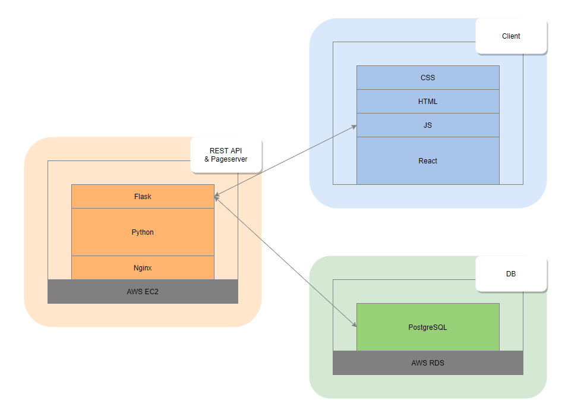

# cloud-app
An AWS-based Flask/React application that serves my portfolio website and exposes API endpoints

# Structure

api/
├-- api/
│	└-- __init__.py
├-- auth/
│	└-- __init__.py
├-- db/
│	└-- __init__.py
├-- portfolio/
│	└-- __init__.py
├-- server/
│	└-- __init__.py
├-- util/
│	├-- __init__.py
│	└-- utilities.py
└-- __init__.py
client/
├-- build/
│	├-- static/
│	├-- index.html
│	└-- images, js, json, etc.
├-- public/
│	└-- images, js, json, etc.
├-- src/
│	├-- components/
│	│	├-- auth.jsx
│	│	├-- login.jsx
│	│	├-- register.jsx
│	│	├-- portfolio.jsx
│	│	├-- topper.jsx
│	│	└-- fetchData.jsx
│	├-- fonts/
│	├-- App.js
│	├-- index.js
│	├-- index.css
│	├-- serviceWorker.js
│	└-- setupTests.js
│	└-- package.json
application.py
config.json
requirements.txt

